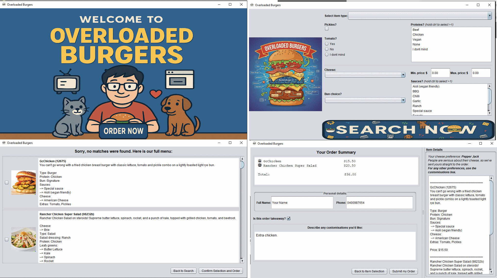

# Overloaded Burgers Ordering System

A restaurant ordering system built with Java Swing, extending base menu-loading function into a complete GUI application with dynamic filtering, search results, and order processing. Developed for COSC120.



## Overview

This project takes a basic menu file loader and transforms it into a full ordering system with four distinct views managed through CardLayout. The architecture follows MVC principles with extensive use of listener interfaces to keep components properly decoupled - no single object knows everything, which makes the system maintainable and extensible.

### What I Built
- Complete GUI layer with responsive layouts and image handling
- Dynamic filter system that adapts based on item type selection
- Search results display with custom item panels
- Multi-step order flow with validation and error handling
- Utility classes for image loading and input validation
- Listener interfaces connecting all components without tight coupling

### Inherited Base Code
Credit to Dr Andreas Shepley for providing:
- Basic structure of `MenuSearcher.java`, `Menu.java`, `MenuItem.java`, `DreamMenuItem.java`
- Basic value enums: `Protein.java`, `Sauce.java`, `Dressing.java`, `Type.java`, `Filter.java` (values and toString only)
- Burger and salad item images
- menu.txt

All GUI components, interfaces, validation, and the extensive Filter.java functionality are my additions.

## Key Features

### Dynamic Filter System
The filter panel changes based on whether you select Burger or Salad - pick Burger and you get bun and sauce options; pick Salad and you get leafy greens and dressing instead. This is all managed through CardLayout to handle view switching without manual component manipulation.

The views prevents logical inconsistencies. For example, it will prevent and warn the user if they try to select "None" and "I don't mind" for the same filter - because the choice is contradictory. "None" means explicitly "don't show me items with this ingredient" while "I don't mind" means it doesn't matter either way.

### Search and Results
Search validation happens at multiple layers. The GUI checks all filters have values and that max price exceeds min price. The InputValidators utility ensures prices are parsable floats. If no matches are found, the full menu displays as a fallback - customers shouldn't hit a dead end.

Each result shows as a custom MenuItemPanel with image and details. The image loading includes a utility to drop file extensions and cycle through valid ones until it finds a match.

### Order Processing
Users can select multiple items via checkboxes, then proceed to order creation where they see:
- Order summary with formatted pricing
- Expandable details panel (JSplitPane lets users resize based on their needs)
- Customer detail entry with regex validation
- Customisation text area

The cheese selection going straight to the final order--unlike other filters--was an assessment requirement. To normalise this inconsistency, I added a dynamic explanation in the UI (dependent on explicit cheese selection or 'I don't mind' choice). After submission, everything resets cleanly for the next customer.

## Technical Implementation

### Architecture Patterns

**MVC with Observer Pattern**  
MenuSearcher handles the model logic but knows nothing about the UI. OrderGui acts as the central controller, coordinating views and passing data. Each view communicates through listener interfaces - ResultsPanel doesn't know about OrderGui, it just fires events to its ResultsPanelListener.

**Smart Enum Pattern**  
The `Filter.java` enum is not just values - it encapsulates all filter-specific business logic:
```java
// Each filter knows its own rules, including:
public boolean allowsMultipleChoices() { ... }
public boolean allowsNoneChoice() { ... }
public String filterPrompt() { ... }
```

This keeps filter logic centralised.

### Layout Management

I used every layout manager for different purposes:
- **BorderLayout**: Main responsive containers that should fill space
- **GridLayout**: Proportionate grids like the button arrays
- **FlowLayout**: Button rows that should maintain size
- **BoxLayout**: Vertical stacking with glue for centering
- **GridBagLayout**: For proportionate weighting

### Responsive Images

Custom painting with rendering hints ensures images scale cleanly:
```java
g2d.setRenderingHint(RenderingHints.KEY_INTERPOLATION, 
                     RenderingHints.VALUE_INTERPOLATION_BILINEAR);
```

For production, I'd cache all images at startup - the current on-demand loading can lag with many results.

## Design Decisions

**Listener Lists vs Single Listeners**  
Views like ResultsPanel only need one listener, but OrderGui and MenuSearcher use lists - future developers might want multiple components observing events.

**Immutable Records**  
Order and FilterSelections use records with defensive copying. Once created, they can't be modified - safer for passing between components.

**Validation Layers**  
1. Field-level during input
2. Panel-level before progression  
3. Final validation before submission

This catches issues early with appropriate error messages at each stage.

**State Management**  
Views are instantiated once at startup for reusability. This meant I couldn't pass data through constructors, leading to data passing via interface for some circumstances like final order population.

## Running the Application

### Prerequisites
- Java 17+
- All required image assets (included)
- menu.txt file (included)

### Execution
```bash
javac *.java
java MenuSearcher
```

The application starts with a welcome screen. Navigate through filter selection, view results, select items, and complete your order. Everything resets after successful submission for the next customer.

## Challenges and Solutions

**GridBagLayout complexity**: Powerful for weighting, but complex for use in multiple dimensions. Solution: nest simpler layouts and only use GridBag for weighted distribution.

**Image format issues**: Built fallback logic to try multiple extensions when loading fails.

**Information passing between views**: With views instantiated at startup, I used the controller to pass field values via interface - imperfect defensive solution, but the cleanest given the constraints.

**Search performance**: Switched image scaling to FAST mode to improve response time with many results.

## Project Structure

### Core GUI Components (Created)
- `OrderGui.java` - Central controller coordinating all views
- `FilterEntryPanel.java` - Dynamic filter interface 
- `ResultsPanel.java` - Search results with selection
- `OrderCreationPanel.java` - Order finalization
- `MenuItemPanel.java` - Individual item display

### Supporting Classes (Created)
- `ImgAndButtonUtilities.java` - Image loading with fallback logic
- `InputValidators.java` - Regex-based validation
- `FilterSelections.java` - Immutable filter selection record
- `Order.java` - Immutable order record
- `SpecialChoice.java` - Special selection handling

### Interfaces (Created)
- `GuiListener.java`
- `OrderingSystemListener.java`
- `ResultsPanelListener.java`
- `OrderCreationPanelListener.java`

### Extended/Enhanced Base Code
- `Filter.java` - Added all smart enum functionality beyond basic values
- `MenuSearcher.java` - Added GUI integration and listeners
- `Menu.java` - Added filtering capabilities

---

*Developed for COSC120, building on base file-loading code to create a complete, working ordering system. The code prioritises clean architecture and user experience, including responsive resizing and comprehensive component decoupling.*
